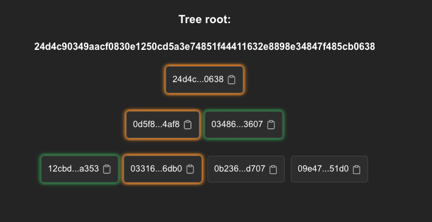

# Merkle Trees: Todo lo que tenés que saber 🌳✨

Este documento es una guía completa sobre los Merkle Trees: qué son, para qué sirven, cómo interactuar con ellos, y cómo aprovecharlos para verificar datos de forma eficiente.

## Términos clave

Antes de adentrarnos en los detalles de los Merkle Trees, repasemos algunos conceptos básicos que te van a ayudar a entender cómo funcionan.

### **Hash**
Un hash es un valor único generado mediante una función matemática que convierte datos en una cadena fija de caracteres. Es la base de toda la estructura del Árbol de Merkle.

- **Propiedades importantes**:
  - **Tamaño fijo**: Un hash siempre tiene la misma longitud, sin importar el tamaño de los datos originales.
  - **Unicidad**: Un cambio en los datos genera un hash completamente diferente.
  - **Irreversibilidad**: No se pueden deducir los datos originales a partir del hash.


💾 **Ejemplo práctico**:  
Si aplicás un hash a la palabra *"Hola"*, el resultado podría ser algo como:  
`0x2cf24dba5fb0a30e26e83b2ac5b9e29e1b161e5c1fa7425e73043362938b9824`.

---

### **Partes de un Árbol de Merkle**

- **Hojas**:  
  Son los nodos más bajos del árbol, y representan los valores originales (como datos o transacciones). Cada hoja contiene el hash de estos datos.  

- **Nodo intermedio**:  
  Es cualquier nodo que no sea una hoja ni la raíz. Se encuentra en los niveles intermedios y almacena un hash generado a partir de combinar los hashes de sus dos nodos hijos.  

- **Hijos**:  
  Los nodos que están inmediatamente por debajo de otro nodo en el árbol. Por ejemplo, en un nodo intermedio, los hijos son los dos nodos cuyas combinaciones de hashes generaron el valor del nodo intermedio.  

- **Raíz (Merkle Root)**:  
  Es el nodo más alto del árbol, generado combinando todos los hashes del nivel intermedio. Representa la totalidad del contenido del árbol.  

---

### **Cómo funcionan juntos**
Cada nodo del árbol depende del hash de sus hijos, lo que significa que cualquier cambio en las hojas afecta a los nodos intermedios y, finalmente, a la raíz. Esto asegura la integridad de toda la estructura.


## ¿Qué es un Árbol de Merkle?

Un Árbol de Merkle es una estructura de datos que organiza información de forma jerárquica, permitiendo verificar su integridad sin necesidad de conocer todos los datos.
Cada hoja del árbol contiene un valor hash, y los nodos intermedios combinan los hashes de sus hijos hasta llegar a la raíz, llamada Merkle Root, que resume todo el contenido del árbol.

💾 **Visualizalo así:**
Es como un árbol genealógico, pero en lugar de nombres, las ramas contienen hashes.

## Usos más comunes

Los Merkle Trees son la columna vertebral de varias tecnologías como:

- **Blockchain:** Verificar transacciones sin descargar toda la cadena.
- **Pruebas de inclusión:** Demostrar que un dato pertenece a un conjunto sin exponer el conjunto entero.
- **Sistemas distribuidos:** Validar que un archivo no fue modificado al sincronizarlo entre nodos.

### Ejemplo práctico:

Tu billetera cripto usa un Árbol de Merkle para asegurarte de que tu transacción está incluida en un bloque, sin descargar todo el historial de la blockchain.

## La forma del Árbol

Un Árbol de Merkle tiene una estructura binaria.

- **Hojas:** Son los hashes individuales de los datos.
- **Nodos intermedios:** Combinan los hashes de sus hijos mediante un hash criptográfico.
- **Raíz:** Es el hash final, que representa todos los datos del árbol.

💾 **Visualización gráfica:**



Este gráfico ilustra cómo los datos se transforman y verifican en cada nivel hasta llegar a la raíz: Los elementos que se pueden ver son:

- **Raíz (Merkle Root):** Es el nodo superior del árbol, que representa el hash que resume toda la estructura.
- **Nodos hoja:** Son los nodos inferiores del árbol, que contienen los hashes de los datos originales.
- **Camino hacia la raíz:** Está resaltado en **naranja**, mostrando el recorrido desde un nodo hoja hasta la raíz del árbol.
- **Nodos hermanos:** Están resaltados en **verde**. Estos son los nodos que se concatenan con el hash actual en cada nivel para calcular el hash del nodo padre.


## Añadir un nodo

Agregar un nodo a un Árbol de Merkle implica:

1. Generar el hash del nuevo valor.
2. Añadirlo a las hojas existentes.
3. Recalcular los nodos intermedios y la raíz.

### Código de ejemplo:

```typescript
const newNodeHash = hashNode("nuevo valor", pedersenHash);
leaves.push(newNodeHash);
const { root, levels } = await buildMerkleTree(leaves);
console.log("Nueva raíz:", root);
```

Esto asegura que cualquier modificación en los datos sea detectable, ya que la raíz cambiará.

## Apéndice: Pedersen Hash

El Pedersen Hash es el hash usado en sistemas criptográficos avanzados como los zk-SNARKs. Es eficiente y tiene propiedades especiales que lo hacen seguro para circuitos de conocimiento cero.

### Ventajas:

- Es más seguro que un hash estándar como SHA-256 en el contexto de pruebas criptográficas.
- Implementacion en Typescript para generar hash en Typescript https://github.com/AztecProtocol/barretenberg/blob/master/ts/src/barretenberg_api/index.ts.

## Probar que un valor pertenece

Para verificar que un valor pertenece al árbol, usamos el hash path, que es el camino de hashes desde la hoja hasta la raíz. Este camino permite recalcular la raíz sin tener todos los datos del árbol.

### Ejemplo de cálculo:

```typescript
const isValid = computeMerkleRoot(leaf, index, hashPath) === root;
console.log("El valor pertenece al árbol:", isValid);
```

## Verificar la raíz

Una raíz válida asegura que el árbol no fue alterado. Esto es clave para sistemas donde la integridad es prioridad. Con Noir, podés verificar la raíz utilizando los siguientes datos:

### Datos de entrada

- **leaf (hoja):** El valor o hash que querés probar que pertenece al árbol.
  💾 **Ejemplo:** Un hash generado de un dato específico, como una dirección o un token.

- **index (índice):** La posición del valor dentro del nivel de hojas.
  💾 **Ejemplo:** Si es la segunda hoja del árbol, el índice sería 1.

- **hash_path (camino de hashes):** Una lista de hashes que conectan la hoja con la raíz. Cada hash representa el hermano del nodo en cada nivel.
  💾 **Ejemplo:** [hash1, hash2, hash3], donde hash1 es el hash hermano en el nivel más cercano a la hoja.

- **root (raíz):** La raíz del Árbol de Merkle, que representa todos los datos del árbol.
  💾 **Ejemplo:** Un hash único como 0xabc123... generado previamente al construir el árbol.

### Proceso de verificación

El verificador recalcula la raíz a partir de la hoja, el índice y el camino de hashes. Luego compara el resultado con la raíz proporcionada. Si coinciden, el valor pertenece al árbol.

### Código de ejemplo en Noir:

```rust
fn main(leaf: Field, index: Field, hash_path: [Field], root: Field) {
    let computed_root = compute_merkle_root(leaf, index, hash_path);
      assert(computed_root == root);
}
```

## Datos de salida

### Resultado booleano (true o false):
Indica si la hoja pertenece al árbol o no.

- **true:** El valor pertenece al árbol; la raíz calculada coincide con la raíz proporcionada.
- **false:** El valor no pertenece al árbol; los datos fueron alterados o no son válidos.

### Raíz calculada (computed_root):
La raíz reconstruida a partir de los datos de entrada. Este valor se utiliza para comparar con la raíz proporcionada.

💾 **Ejemplo:** Si la raíz original es 0xabc123..., el circuito debe calcular el mismo valor.

## Uso de Noir para verificar la raíz

Noir simplifica la creación de circuitos para verificar Merkle Trees. Podés usarlo para:

- Verificar inclusión.
- Crear ZKProofs para asegurar la privacidad de los datos.
